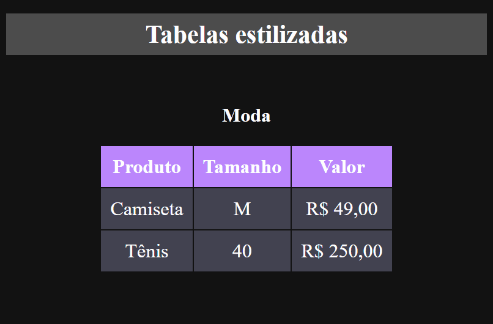

# Projeto Tabela estilizada

## Um repositório para o desafio da aula de HTML + CSS básico.

[]

## Tecnologias utilizadas
- HTML

- CSS

## Desafio realizado nesse projeto

-Faça uma tabela
de roupas com tamanho e valor da peça descrito em cada linha.

-Não esqueça de adicionar um cabeçalho em cada coluna.

-Cor de fundo do cabeçalho moda - #BB86FC.

-Cor de fundo do cabeçalho casa - #00C4B4.

-Cor de fundo dos valores da tabela - #424250.

-Regra: não estilize usando as tags HTML, crie classes para estilizar sua tabela.
EX: .produtos-casa th { … }